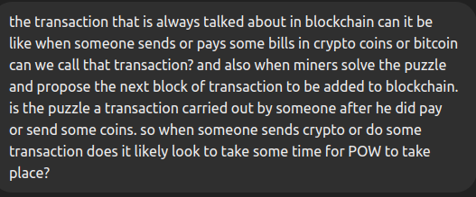

# what is Blockchain Transaction
 A *Transaction* , is any operation that involves the transfer of data or value from one party to another .
 
 i.e 
  1. *Sending cryptocurrency*: When someone sends Bitcoin (or another cryptocurrency) to someone else, this action creates a transaction.

 2. *Paying bills*: If someone pays bills using cryptocurrency, this payment is recorded as a transaction on the blockchain.